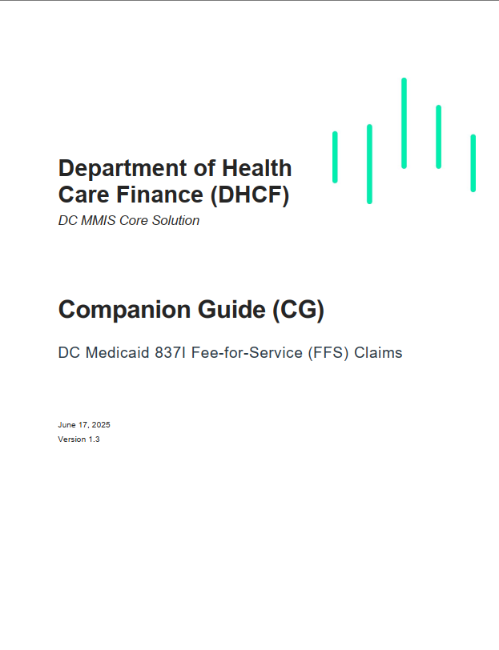
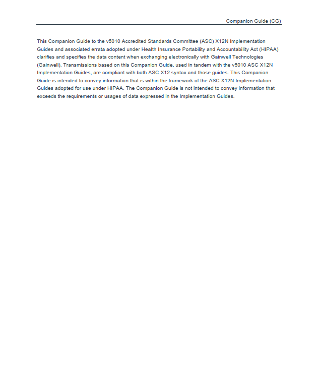

# DC DHCF Companion Guides

**Authored during Gainwell Technologies Internship (Summer 2025)**  
**Jordan** – Technical Writer

---

## Official Public Documents

These **HIPAA-compliant** EDI Companion Guides are **published by Gainwell** for DC Medicaid trading partners.

| Guide | Version | Pages | PDF |
|-------|--------|-------|-----|
| **837I Institutional Claims** | v1.3 (Jun 17, 2025) | 21 | [Download](pdfs/837I-v1.3.pdf) |
| **276/277 Claim Status** | v1.1 (Feb 5, 2025) | 30 | [Download](pdfs/276-277-v1.1.pdf) |

---

## My Contributions

- **Authored** 837I v1.3 update
- **Edited & enhanced** 276/277 v1.1
- Added **clear segment tables**, **error code mappings**, and **interactive flow diagrams**
- Ensured **ASC X12N 5010 compliance**

---

## Enhanced 276/277 Guide

I reformatted dense PDF sections into clean, scannable, interactive content:

[View Legible 276/277 Guide →](276-277-enhanced.md)

---

## Screenshots

| 837I Title | 837I Intro |
|-----------|------------|
|  |  |

---

*All documents publicly available via Gainwell DC Medicaid portal.*
